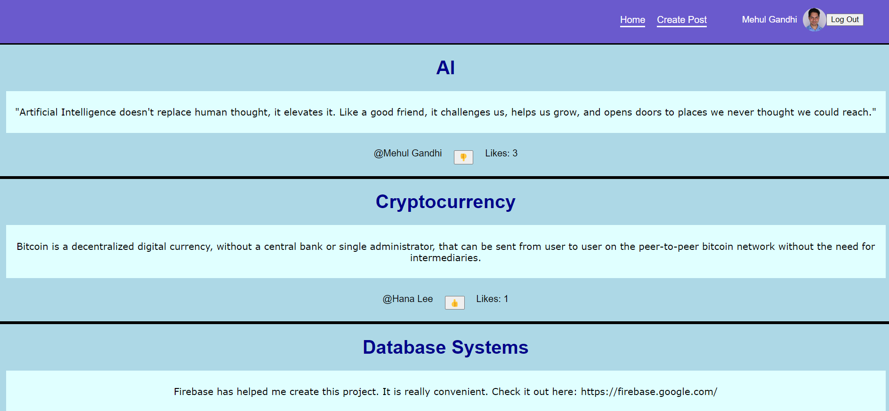

# BulletinBoardHub
Create posts to be shared with users on a public bulletin board. Allows users to like shared posts. Built with Firebase, React, JavaScript, and TypeScript.

##Features
-Login authentication using Firebase Google Login
-Create a post with a title and description
-View the bulletin board hub, containing all created posts
-Like and unlike posts

